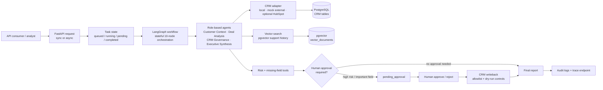
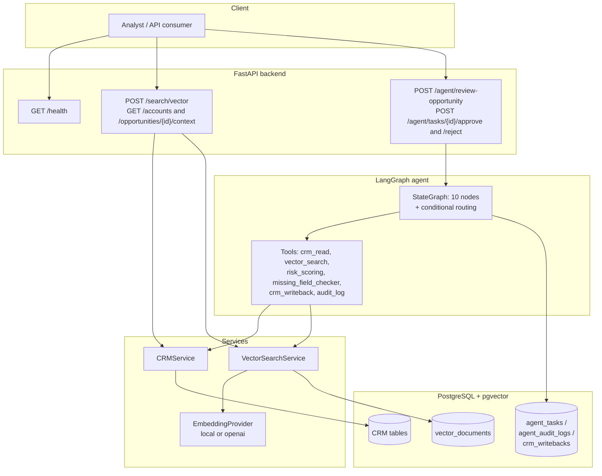
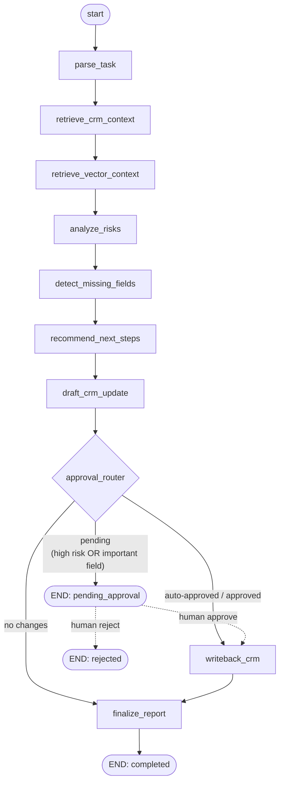
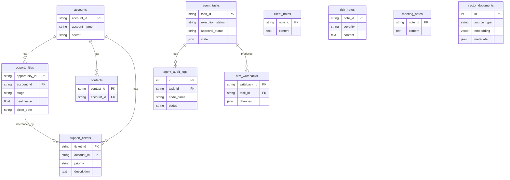

# DealFlow AI Agent

[](https://github.com/bobaoxu2001/dealflow-ai-agent/actions/workflows/ci.yml)
[](https://www.python.org/)
[](https://fastapi.tiangolo.com/)
[](https://langchain-ai.github.io/langgraph/)
[](https://www.docker.com/)
[](LICENSE)

> **A LangGraph-powered enterprise CRM workflow agent for opportunity review, risk analysis, customer-context retrieval, and human-approved CRM writeback.**

DealFlow AI Agent is a production-style **AI agent system** — not a chatbot, not a
dashboard, not a toy RAG demo. It models a real enterprise workflow: a sales/CS
analyst hands the agent a sales opportunity, and the agent reviews structured CRM
data, retrieves unstructured customer-support history via vector search, scores
deal risk, detects missing CRM fields, recommends next steps, drafts a CRM
update, and — when the change is high-risk — **pauses for human approval before
writing back**. Every step is persisted and audited.

---

## Architecture at a glance



---

## Quick proof

- **CI passing** on GitHub Actions across three jobs: a full **offline SQLite** suite, a **PostgreSQL + pgvector** integration job, and a **Docker image build**
- **Tests passing** (`pytest`) — full offline suite + native pgvector integration tests
- **Real Kaggle data verified** end-to-end — not just the offline demo seed
- **8,800** CRM opportunities, **8,469** support tickets, **24,521** vector documents loaded and searchable
- Real opportunity **`OM8LELJW`** (account `ACC-0039` / *Iselectrics*) run through the full agent: reviewed at **risk 0.9 → `pending_approval` → approved writeback** (`stage`: `Engaging` → `On Hold`), persisted with audit logs
- Optional real **HubSpot CRM adapter** with dry-run writeback, strict field allowlist, and mocked API tests

> Full numbers and provenance are in [Real data verification](#real-data-verification).
> Note: this is a portfolio project — it runs locally and in CI, and is **not** deployed to production.

---

## What this proves

In one project, end-to-end and reproducibly:

- I can build **stateful, multi-step agent orchestration** in LangGraph — not a
  prompt chain — with conditional routing and a durable human-in-the-loop pause.
- I can combine **structured (PostgreSQL) and unstructured (pgvector) data**
  inside an agent's reasoning, behind a clean services layer.
- I can put **safety and auditability first**: explicit approval rules, node-level
  audit logs, an execution-trace endpoint, and an LLM that is *architecturally
  barred* from writing to the CRM.
- I can ship it like an engineer: **dual CI** (SQLite + pgvector), an
  **evaluation harness**, idempotent error handling, Docker, and honest docs.

## Why this is not just a chatbot

| A chatbot… | DealFlow AI Agent… |
|---|---|
| Returns a text reply | Runs a 10-node **stateful workflow** with conditional routing |
| Is stateless per turn | **Persists state**; a pending task survives a restart and resumes |
| Acts immediately | **Pauses for human approval** before any high-risk CRM write |
| Has no audit trail | Writes **node-level audit logs** + exposes a **/trace** endpoint |
| Lets the model "do things" | The LLM **cannot** trigger a writeback or skip approval — that logic is deterministic |
| Reads one context window | Retrieves **structured CRM + vector search** over support history |

## Production-style features

- [x] Stateful **LangGraph** workflow (typed state, conditional edges)
- [x] **Role-based multi-agent** layer supervised by LangGraph (not free-form autonomous agents)
- [x] **Long-running async** execution (`POST /agent/review-opportunity-async`: queued → running → terminal)
- [x] **Human approval** required before risky CRM writeback
- [x] **Audit logs + node instrumentation** (timing/status) + `GET /agent/tasks/{id}/trace` observability
- [x] **Vector retrieval** (pgvector native `<=>`, SQLite Python fallback)
- [x] **Structured + unstructured** data integrated in one store
- [x] **Optional LLM** final-report synthesis (deterministic fallback, no key needed)
- [x] **Pluggable CRM adapter** (local default; optional HubSpot, dry-run by default)
- [x] **Evaluation** harness (`make evaluate`) + docs
- [x] **Docker** Compose (API + pgvector Postgres) + **Docker-build CI** (build only)
- [x] **Triple CI** (offline SQLite suite + PostgreSQL/pgvector integration + Docker build)
- [x] **Local fallback mode** — runs with no LLM/embedding API keys
- [x] **Real-data verification** on two public Kaggle datasets
- [ ] Production deployment — *intentionally out of scope* (see below)

## Known limitations / honest scope

- **Not production-deployed.** It runs locally and in CI. Productionization is
  designed and documented in [`docs/productionization.md`](docs/productionization.md), not built.
- **Deterministic heuristics by default.** Risk scoring and CRM drafting are
  explainable rules (for testability), not learned models. An LLM is optional and
  only writes the narrative summary.
- **Synthetic linking layer.** The two Kaggle datasets share no native IDs, so
  support tickets are linked to CRM accounts via a documented, deterministic
  (seeded) mapping. Underlying rows are real; the join is synthetic and flagged.
- **Embedding quality.** The default local hashing embedder is key-free but not
  semantically strong; swap in a real model via one config change.
- **CI database split.** The SQLite job runs the full offline suite; the
  PostgreSQL job verifies the native pgvector path with the demo seed (CI does not
  download Kaggle data).

---

## Why this project matters

Enterprise teams make opportunity decisions across **fragmented data**: CRM
records, account data, meeting notes, support tickets, and internal documents.
The hard part of "AI for the enterprise" isn't generating text — it's
**orchestrating a reliable, stateful, multi-step workflow** that combines
structured and unstructured data, routes between tools, knows when to stop for a
human, and leaves an audit trail you can trust.

This project demonstrates exactly that.

## Engineering focus

This project focuses on **production-style AI agent orchestration systems rather
than model training**. It runs locally and in CI and is **not** deployed to
production.

## Technical capabilities demonstrated

| Capability | Where it's demonstrated |
|---|---|
| LangGraph / LangChain agent orchestration | [`app/agents/graph.py`](app/agents/graph.py), [`app/agents/roles.py`](app/agents/roles.py) |
| Complex multi-step workflows | 10-node LangGraph workflow with conditional routing and role-based agents |
| Tool routing and dynamic tool usage | [`app/tools/`](app/tools), [`app/integrations/crm_adapter.py`](app/integrations/crm_adapter.py) — vector / risk / CRM-writeback tools |
| Long-running async execution | `POST /agent/review-opportunity-async`: `queued → running → completed / pending_approval / error` |
| Role-based agent coordination | `CustomerContextAgent`, `DealAnalysisAgent`, `CRMGovernanceAgent`, `ExecutiveSynthesisAgent` (supervised by LangGraph) |
| LLM synthesis + structured data + external APIs | Optional LLM final synthesis, PostgreSQL CRM data, pgvector retrieval, optional HubSpot adapter |
| Human-in-the-loop approval | `approval_router` → pause → `approve`/`reject` → resume |
| PostgreSQL + pgvector retrieval | pgvector integration tests, `vector_documents`, native pgvector CI job ([`app/db/`](app/db), [`vector_search_service.py`](app/services/vector_search_service.py)) |
| External data ingestion | Two real Kaggle datasets + scripted pipeline |
| FastAPI backend | [`app/main.py`](app/main.py), [`app/api/`](app/api) |
| Dockerized runtime | [`Dockerfile`](Dockerfile), [`docker-compose.yml`](docker-compose.yml), Docker-build CI |
| CI/CD validation | GitHub Actions: SQLite tests, Postgres/pgvector integration, Docker build ([`.github/workflows/ci.yml`](.github/workflows/ci.yml)) |
| Testing and documentation | `pytest`, evaluation harness, `/trace` endpoint, [`docs/interview_walkthrough.md`](docs/interview_walkthrough.md), [`docs/productionization.md`](docs/productionization.md) |

---

## Data sources

This project uses **two public Kaggle datasets to simulate an enterprise CRM
environment. A small synthetic workflow layer is generated to connect CRM
opportunities with customer support history and agent approval/writeback
records.**

| # | Dataset | Kaggle slug | Role |
|---|---|---|---|
| 1 | CRM Sales Opportunities | `nilkamalsaha/crm-sales-opportunities-on-google-sheets` | Structured CRM foundation: accounts, opportunities, products, sales teams |
| 2 | Customer Support Tickets | `suraj520/customer-support-ticket-dataset` | Unstructured customer history: support tickets → client/risk notes → embeddings |

### Real data vs. synthetic workflow layer

The two datasets **do not share a join key** (the CRM dataset keys accounts by
*name*; the support dataset has no account id at all). The transform pipeline
therefore makes a few **documented, deterministic** mapping decisions and adds a
clearly-labeled synthetic layer. Nothing in the underlying CRM/support *rows* is
fabricated — only the workflow scaffolding that a real enterprise system would
have but a static export does not.

| Item | Source | Notes |
|---|---|---|
| `account_id` (e.g. `ACC-0001`) | derived | Stable surrogate minted from sorted unique account names |
| support ticket → account / opportunity link | derived | Deterministic hash of `ticket_id` (seeded) maps each ticket to an account, then to one of that account's opportunities |
| `client_notes`, `risk_notes` | derived from real ticket text | Risk notes come from low-satisfaction / high-priority tickets |
| `meeting_notes` | synthetic (`is_synthetic=true`) | Grounded in real account names |
| missing CRM fields, agent tasks, approval states, writeback seeds | synthetic (`is_synthetic=true`) | Deterministic seed (`SEED=42`) |

> **Run it without Kaggle:** `make seed-demo` loads a small, clearly-synthetic
> demo dataset so the entire stack (API, vector search, agent, approval flow,
> tests) runs fully offline with **no Kaggle credentials and no API keys**.

---

## Real data verification

The numbers below come from an actual end-to-end run of the pipeline against the
**two live Kaggle datasets** (downloaded via `kagglehub`, transformed, loaded,
embedded, and queried). The demo seed (`make seed-demo` / `OPP-DEMO*`) was
**not** used for this verification — this is the real Kaggle data flowing all the
way through the LangGraph agent.

**Datasets used**

- `nilkamalsaha/crm-sales-opportunities-on-google-sheets`
- `suraj520/customer-support-ticket-dataset`

**Raw row counts** (`scripts/inspect_datasets.py`, from `data/raw/`)

| Raw file | Rows |
|---|---|
| `accounts.csv` | 85 |
| `sales_pipeline.csv` (opportunities) | 8,800 |
| `products.csv` | 7 |
| `sales_teams.csv` | 35 |
| `customer_support_tickets.csv` | 8,469 |

**Loaded row counts** (after transform + synthetic linking, in the database)

| Table | Rows | Origin |
|---|---|---|
| `accounts` | 85 | Kaggle CRM |
| `opportunities` | 8,800 | Kaggle CRM |
| `support_tickets` | 8,469 | Kaggle support |
| `client_notes` | 8,469 | derived from real ticket text |
| `risk_notes` | 4,729 | derived from real ticket text |
| `vector_documents` | 24,521 | embedded support/client/risk/meeting text |

**Example: a real opportunity through the full agent + approval flow**

A real opportunity from `sales_pipeline.csv` (`is_synthetic=false`) was run
through `POST /agent/review-opportunity` and then approved:

| Field | Value |
|---|---|
| Opportunity ID | `OM8LELJW` |
| Account | `ACC-0039` / *Iselectrics* |
| Original stage | `Engaging` |
| Risk score | `0.9` |
| Agent status after review | `pending_approval` (high risk → routed to human) |
| Approved writeback | `stage`: `Engaging` → `On Hold` (persisted to `crm_writebacks`) |

The agent retrieved structured CRM context, pulled the account's support history
via vector search, scored risk from real ticket signals (open/high-priority
tickets, refund/cancel mentions), drafted a CRM update, and — because the change
touched an important field on a high-risk deal — **paused for human approval**
rather than writing back automatically. After approval it resumed and applied
the change.

> **Why a synthetic linking layer:** the two public datasets do **not** share
> native IDs (the CRM dataset keys accounts by name; the support dataset has no
> account identifier at all). Support tickets are therefore connected to CRM
> accounts and opportunities through a **deterministic, seeded** mapping (a hash
> of `ticket_id`), so the link is reproducible and clearly documented rather than
> random. The underlying CRM and support *rows* remain the real Kaggle data —
> only the join and workflow scaffolding are synthetic.

---

## System architecture



## LangGraph workflow



**Routing logic**

- High risk (`risk_score >= HIGH_RISK_THRESHOLD`) **or** a drafted change to an
  important field (`stage`, `deal_value`, `close_date`) ⇒ route to human approval.
- If approval is required, the graph **stops** and the task is persisted as
  `pending_approval` (durable in `agent_tasks.state`, so it survives restarts).
- `approve` resumes a small resume-graph (`writeback_crm → finalize_report`).
- `reject` marks the task `rejected` and performs **no** writeback.
- If no approval is required and there are changes, it writes back automatically;
  if there are no changes, it skips straight to the final report.

## Database schema (overview)



---

## System design notes

### PostgreSQL + pgvector

- Structured CRM data lives in normalized relational tables.
- Unstructured text (support ticket descriptions/resolutions, client/risk/meeting
  notes) is embedded and stored in `vector_documents`.
- **Portable embedding column** ([`app/db/vector.py`](app/db/vector.py)): on
  PostgreSQL it uses the native pgvector `Vector` type with cosine-distance
  operators (`<=>`); on SQLite it transparently falls back to JSON-encoded
  vectors with Python-side cosine ranking. The *same models and tests* run on
  both, which is what lets the project be zero-infra locally yet
  Postgres-native in Docker.

### Embedding provider abstraction

[`app/services/embedding_service.py`](app/services/embedding_service.py) defines
an `EmbeddingProvider` interface with two implementations:

- **`LocalEmbeddingProvider`** (default) — deterministic hashing embedder. No API
  key, no network, identical vectors across runs ⇒ stable tests and offline demo.
- **`OpenAIEmbeddingProvider`** — real embeddings when `OPENAI_API_KEY` is set.

Switching is a one-line config change (`EMBEDDING_PROVIDER`).

### Deterministic, key-free agent nodes

The **orchestration** is the point: LangGraph state, conditional routing, tool
calls, the human-in-the-loop pause/resume, and the audit trail. Node *internals*
(risk scoring, draft generation) are explainable deterministic heuristics by
default, so the workflow is reproducible and runs with no LLM key. Each node can
be swapped for an LLM-backed implementation without touching the graph.

### State persistence & auditability

- The full `AgentState` is snapshotted to `agent_tasks.state` (JSON) after every
  run, enabling restart-safe resume after approval.
- Every node writes a row to `agent_audit_logs` with `task_id`, `node_name`,
  input/output summaries, status, timestamp, and any error.
- Approved writebacks are recorded in `crm_writebacks` with old→new field diffs.

---

## Optional real CRM integration

The default project runs **fully locally with no secrets** — `CRM_ADAPTER=local`
is the default, and CRM reads/writes go to its own PostgreSQL/SQLite store. An
optional **HubSpot adapter** demonstrates that the agent is *ready to integrate
with a real external CRM API*, behind a pluggable adapter
(`app/integrations/crm_adapter.py`): `local` (default), `mock_external`, or
`hubspot`.

- **Enable HubSpot** with `CRM_ADAPTER=hubspot` to use the HubSpot CRM v3 API
  (opt-in; requires `HUBSPOT_ACCESS_TOKEN`).
- **Writeback is dry-run by default** (`HUBSPOT_DRY_RUN=true`) — the HubSpot
  adapter validates and maps the change but sends **no** PATCH. A **real PATCH
  requires `HUBSPOT_DRY_RUN=false`**.
- **Human approval is still required** before any writeback — the adapter changes
  *where* writes go, not *whether* they're approved. The LLM has no path to write.
- Real writes use a **strict field allowlist** (`dealstage`, `amount`,
  `closedate`, `dealflow_ai_status`); anything else is rejected.
- **CI uses the `local`/`mock_external` adapters only.** HubSpot tests run against
  `httpx.MockTransport` — no network, no token. No secrets are committed.

See [`docs/integrations.md`](docs/integrations.md) for env vars, an example
`.env`, and the full safety model, and
[`docs/demo/hubspot_dry_run_demo.md`](docs/demo/hubspot_dry_run_demo.md) for a
local-only, dry-run verification walkthrough against your own sandbox HubSpot.

---

## API reference & sample curl commands

Base URL (local): `http://localhost:8000`

### Health
```bash
curl -s http://localhost:8000/health | jq
```

### Vector search
```bash
curl -s -X POST http://localhost:8000/search/vector \
  -H 'Content-Type: application/json' \
  -d '{"query": "customer threatening to churn", "account_id": "ACC-DEMO1", "top_k": 3}' | jq
```

### Opportunity context (structured + retrieved docs)
```bash
curl -s "http://localhost:8000/opportunities/OPP-DEMO1/context" | jq
```

### Start an opportunity review (runs the agent)
```bash
curl -s -X POST http://localhost:8000/agent/review-opportunity \
  -H 'Content-Type: application/json' \
  -d '{"opportunity_id": "OPP-DEMO1", "task": "Review this opportunity, identify blockers, summarize client history, and recommend next steps."}' | jq
```

### Start a review asynchronously (long-running mode)
Returns a `task_id` immediately and runs the workflow in the background
(`queued → running → completed | pending_approval | error`). Poll the status or
trace endpoint for progress.
```bash
curl -s -X POST http://localhost:8000/agent/review-opportunity-async \
  -H 'Content-Type: application/json' \
  -d '{"opportunity_id": "OPP-DEMO1"}' | jq
```

### Get agent task status
```bash
curl -s http://localhost:8000/agent/tasks/<TASK_ID> | jq
```

### Get the execution trace (ordered node-by-node audit)
```bash
curl -s http://localhost:8000/agent/tasks/<TASK_ID>/trace | jq
```

### Approve a pending CRM writeback (resumes the workflow)
```bash
curl -s -X POST http://localhost:8000/agent/tasks/<TASK_ID>/approve \
  -H 'Content-Type: application/json' -d '{"approver": "manager"}' | jq
```

### Reject a pending writeback
```bash
curl -s -X POST http://localhost:8000/agent/tasks/<TASK_ID>/reject \
  -H 'Content-Type: application/json' -d '{"approver": "manager", "reason": "needs more discovery"}' | jq
```

Interactive API docs are available at `http://localhost:8000/docs`.

---

## Demo walkthrough

1. **High-risk deal → human approval.** Review `OPP-DEMO1` (Northwind). It has
   critical/open support tickets full of churn/competitor/refund signals and a
   missing `close_date`. The agent scores it high-risk and drafts a `stage`
   change ⇒ `approval_status: pending`, `execution_status: pending_approval`.
   **No writeback happens yet.**
2. **Approve.** Call `/approve`. The resume-graph runs `writeback_crm →
   finalize_report`; the `stage` change is applied and recorded in
   `crm_writebacks` ⇒ `execution_status: completed`.
3. **Low-risk deal → straight through.** Review `OPP-DEMO2` (Initech): clean
   data, a single happy/closed ticket. No risky changes are drafted ⇒ completes
   immediately with `approval_status: not_required`.
4. **Reject.** Re-run `OPP-DEMO1`, then `/reject` ⇒ `execution_status: rejected`
   and **no** writeback.

Inspect the audit trail any time via `GET /agent/tasks/{task_id}` (`audit_log`)
or the `agent_audit_logs` table.

---

## Running locally

### Option A — zero-infra (SQLite, offline)
```bash
make install         # pip install -r requirements.txt (in a venv)
make seed-demo       # create tables + load the offline demo dataset
make dev             # uvicorn on http://localhost:8000
```

### Option B — Docker (FastAPI + PostgreSQL + pgvector)
```bash
make docker-up       # build & start api + db (pgvector/pgvector:pg16)
make docker-ingest   # seed the offline demo dataset inside the container
# ... or run the real Kaggle pipeline (see below) ...
make docker-down
```

### Ingesting the real Kaggle datasets
Requires Kaggle credentials (`~/.kaggle/kaggle.json` or `KAGGLE_USERNAME` /
`KAGGLE_KEY`).
```bash
make download    # download both datasets into data/raw/
make inspect     # print row counts, columns, missing values, samples
make transform   # normalize -> data/processed/*.csv
make synth       # generate the synthetic workflow layer
make load        # load processed CSVs + build the vector index
# shortcut:
make ingest      # download + transform + synth + load
```

### Testing
```bash
make test        # pytest: health, ingestion, vector search, agent happy path,
                 #         approval-required path, rejection path
make lint        # ruff
```

---

## What this demonstrates

- **Agent orchestration over chat:** a real LangGraph `StateGraph` with typed
  state, conditional routing, tool calls, and a durable human-in-the-loop pause.
- **Structured + unstructured fusion:** relational CRM joined with pgvector
  semantic retrieval in a single workflow.
- **Production hygiene:** config/logging/error handling, a provider abstraction
  with offline fallback, audit logging, Docker, CI, and tests for the tricky
  paths (approval and rejection), not just the happy path.
- **Honest scoping:** clearly-labeled synthetic workflow layer, documented data
  mappings, deterministic behavior, no overclaimed "production deployment."

## Capability coverage (detail)

How the project's capabilities map to the implementation:

| Capability | How DealFlow implements it |
|---|---|
| **Long-running tasks** | `POST /agent/review-opportunity-async` returns a `task_id` immediately and runs the workflow in the background with persisted status transitions (`queued → running → completed / pending_approval / error`). |
| **Multi-agent coordination** | A role-based agent layer (`DealAnalysisAgent`, `CustomerContextAgent`, `CRMGovernanceAgent`, `ExecutiveSynthesisAgent`) supervised by LangGraph — bounded, testable roles, not free-form autonomous agents. See [`docs/multi_agent_design.md`](docs/multi_agent_design.md). |
| **External APIs** | Pluggable CRM adapter with an optional **HubSpot CRM v3** integration (`httpx`), dry-run by default, strict writeback allowlist, clean error handling. See [`docs/integrations.md`](docs/integrations.md). |
| **Structured + unstructured data** | PostgreSQL CRM tables + pgvector semantic retrieval over support history, fused inside the agent's reasoning. |
| **Reliability & observability** | Node-level audit logs with **timing instrumentation**, a `/trace` endpoint, an evaluation harness, and three CI jobs (SQLite suite, pgvector integration, Docker build). |
| **Deployment awareness** | A Docker-build CI job validates the image builds; nothing is deployed and the README never claims production deployment. |

## Future improvements

- Swap deterministic node logic for LLM-backed nodes (LangChain) with the
  existing tool surface; add structured-output validation.
- Use a persistent LangGraph checkpointer (Postgres) for native interrupt/resume.
- Add streaming progress (SSE) for long-running reviews.
- Hybrid retrieval (BM25 + vector) and reranking.
- Role-based auth on approval endpoints + per-approver audit identity.
- Optional Streamlit review console on top of the existing API.

---

## Resume bullets

**DealFlow AI Agent — LangGraph Enterprise CRM Workflow Automation**

- Built a production-style AI agent system that automates long-running CRM
  opportunity-review workflows across structured sales data and customer-support
  history from two public Kaggle datasets.
- Designed LangGraph orchestration with stateful execution, dynamic tool routing,
  human-in-the-loop approval, and CRM writeback safeguards.
- Implemented a PostgreSQL + pgvector retrieval layer combining structured CRM
  records with embedded support tickets, meeting notes, and risk notes, behind a
  pluggable embedding provider with a deterministic offline fallback.
- Containerized the FastAPI application with Docker/Compose and added GitHub
  Actions CI for linting and tests.
- Created node-level audit logs and persisted execution state to improve
  transparency, debuggability, and restart-safe resumability.

---

## Portfolio case study

- **Problem:** Enterprise teams manage opportunity decisions across fragmented
  CRM records, notes, tickets, and documents.
- **Approach:** A stateful LangGraph agent that combines CRM data, vector
  retrieval, risk scoring, tool routing, and approval-based CRM writeback.
- **Technical implementation:** FastAPI, LangGraph, PostgreSQL, pgvector, Docker,
  GitHub Actions CI, and node-level audit logs.
- **Result:** A production-style AI agent workflow that demonstrates enterprise AI
  orchestration — not just chatbot response generation.
- **Role relevance:** AI agent engineering, workflow orchestration,
  structured/unstructured data integration, long-running task management, and
  maintainable backend architecture.

## Project structure

```
dealflow-ai-agent/
  app/
    api/routes/        # health, search, agent endpoints
    agents/            # graph.py, state.py, nodes.py, routers.py
    tools/             # crm/vector/risk/approval/audit tools
    db/                # models, session, init_db, portable vector column
    services/          # crm, vector search, embeddings, tasks, approval
    schemas/           # pydantic request/response models
    utils/             # config, logging
    main.py            # FastAPI app
  scripts/             # download / inspect / transform / synth / load / seed_demo
  tests/               # health, ingestion, vector, agent, approval
  .github/workflows/   # ci.yml
  docker-compose.yml  Dockerfile  Makefile  requirements.txt  .env.example
  docs/                # interview_walkthrough.md, portfolio_summary.md
  LICENSE              # MIT
```

---

## Further docs

- [`docs/interview_walkthrough.md`](docs/interview_walkthrough.md) — 30-second pitch, 2-minute technical walkthrough, "what changed in v2", and likely interview Q&As.
- [`docs/portfolio_summary.md`](docs/portfolio_summary.md) — resume bullets, LinkedIn post, and role positioning.
- [`docs/project_review.md`](docs/project_review.md) — self-review scorecard (what's strong / limited / improved / next).
- [`docs/multi_agent_design.md`](docs/multi_agent_design.md) — role-based agents and how LangGraph supervises them.
- [`docs/evaluation.md`](docs/evaluation.md) — evaluation approach and example results.
- [`docs/integrations.md`](docs/integrations.md) — pluggable CRM adapters (local / mock_external / HubSpot), env vars, and the writeback safety model.
- [`docs/productionization.md`](docs/productionization.md) — honest map of what would change for production.
- [`docs/demo/`](docs/demo/) — copy-paste [demo commands](docs/demo/demo_commands.md), a [terminal walkthrough](docs/demo/terminal_demo.md), a [video script](docs/demo/video_script.md), a [HubSpot dry-run guide](docs/demo/hubspot_dry_run_demo.md), and sample JSON responses ([agent](docs/demo/sample_agent_response.json) · [trace](docs/demo/sample_trace_response.json) · [evaluation](docs/demo/sample_evaluation_summary.json)).

---

## Repository metadata suggestion

Suggested GitHub **About** settings for this repo (Settings → General / the
sidebar gear on the repo home):

**Description**

```
LangGraph-powered enterprise CRM workflow agent with FastAPI, PostgreSQL/pgvector, human approval, audit logs, Docker, and CI.
```

**Topics**

```
langgraph, langchain, fastapi, ai-agents, llm, rag, pgvector, postgresql, crm, workflow-automation, human-in-the-loop, docker, github-actions
```
